# Wilms Tumor — Genomic Survival Analysis

> **Disease:** Wilms tumor (nephroblastoma)
> **Data source:** cBioPortal for Cancer Genomics via REST API
> **Cohorts:** Pediatric Wilms' Tumor (TARGET, 2018)
> **Patients:** 652 total · 652 with survival data · 114 OS events · 211 EFS events
> **Analysis:** Kaplan-Meier survival + multivariate Cox regression · lifelines v0.30.3 (Python)

---

<!-- Overview: one paragraph explaining the study goal and how it mirrors the prostate manuscript -->

## Overview

This analysis characterizes the prognostic impact of 14 recurrently mutated genes in Wilms tumor using the publicly available cBioPortal cohort `wt_target_2018_pub` (Pediatric Wilms' Tumor TARGET 2018, N=652). Patients are stratified as genomically altered vs. wildtype per gene using mutation and copy-number data retrieved from cBioPortal, followed by Kaplan-Meier survival curves and multivariate Cox regression. Genes are organized by functional pathway (Cell Cycle, Transcription Regulation, RNA Processing, WNT Signaling, Chromatin Remodeling, PanCancer), and pathway-level OR-classifiers are used to aggregate rare variants that individually fall below the minimum sample-size threshold. An mRNA z-score analysis is run in parallel for the 125-patient expression subset.

---

<!-- Gene catalog: all 14 genes with pathway assignment and mutation frequency from the analysis -->

## Gene Catalog

| Gene | Pathway | Alteration Type | Freq (%) | n Altered | KM Run |
|---|---|---|---|---|---|
| IGF2 (Expr) | p53 & Growth | mRNA z-score > 1.5 (loss of imprinting) | 8.0% | 10 / 125 | No (n=10) |
| IGF2 (CNA) | p53 & Growth | Copy-number gain (CNA >= +1) | 4.0% | 5 / 124 | No (n=5) |
| MYCN | Transcription Reg | Any mutation + amplification (CNA >= +2) | 2.8% | 18 | No (n=18) |
| TP53 | Cell Cycle | All somatic mutations + deletion (CNA <= -2) | 2.3% | 15 | No (n=15) |
| MDM4 | p53 & Growth | Any mutation + amplification (CNA >= +2) | 0.8% | 5 | No (n=5) |
| SIX1/SIX2 | Transcription Reg | Q177R hotspot only (SIX1 or SIX2) | 0.8% | 5 | No (n=5) |
| WT1 | WNT Signaling | Truncating mutations + homodeletion (CNA <= -2) | 0.8% | 5 | No (n=5) |
| SIX1 | Transcription Reg | Q177R hotspot only (exon 1) | 0.6% | 4 | No (n=4) |
| CTNNB1 | WNT Signaling | Exon 3 hotspot mutations (codons 32-45) | 0.5% | 3 | No (n=3) |
| MDM2 | p53 & Growth | Any mutation + amplification (CNA >= +2) | 0.2% | 1 | No (n=1) |
| SIX2 | Transcription Reg | Q177R hotspot only (exon 1) | 0.2% | 1 | No (n=1) |
| DROSHA | RNA Processing | Truncating mutations only | 0.2% | 1 | No (n=1) |
| AMER1 | WNT Signaling | Truncating mutations only | 0.2% | 1 | No (n=1) |
| DGCR8 | RNA Processing | Truncating mutations only | 0.0% | 0 | No (n=0) |
| MLLT1 | Chromatin Remodeling | All mutation types + deletion (CNA <= -2) | 0.0% | 0 | No (n=0) |
| NIPBL | PanCancer | Truncating mutations only | 0.0% | 0 | No (n=0) |

> **Note:** Genes marked "No" in KM Run had too few altered patients (n < 20) for reliable survival curve estimation. This low individual-gene frequency is a well-known feature of Wilms tumor biology. Pathway-level OR-classifiers (see Section 5) aggregate these rare variants to enable analysis.

---

<!-- Mutation frequency chart: shows how often each gene is mutated across the cohort -->

## Alteration Frequency

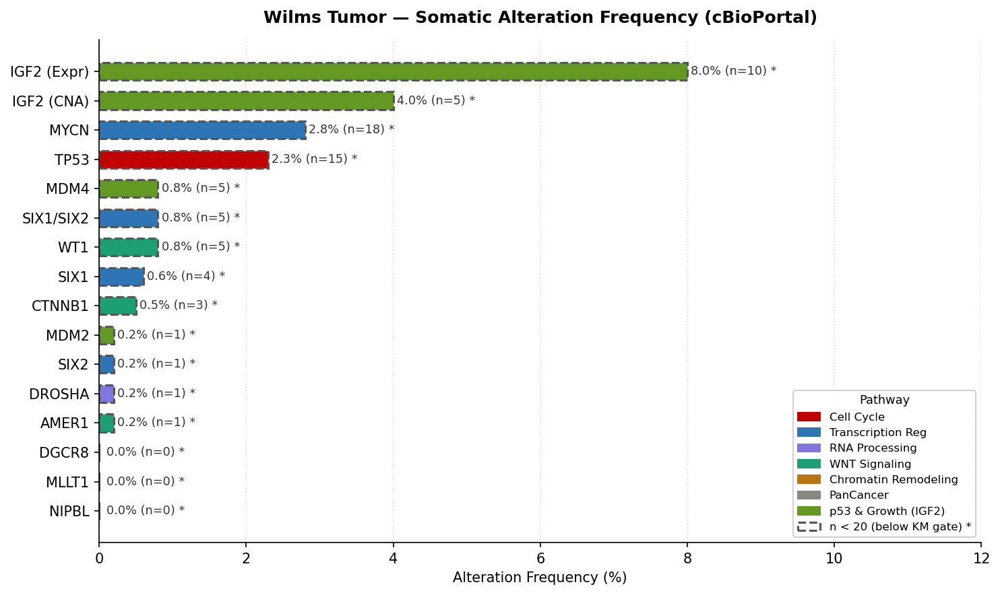

MYCN (2.8%) is the most frequently altered individual gene by somatic mutation, followed by TP53 (2.3%). IGF2 shows the highest frequency when assessed by mRNA expression (8.0%), reflecting loss of imprinting rather than somatic mutation. No individual gene reached the n >= 20 altered-patient threshold required for Kaplan-Meier analysis; all pathway-level signals were captured through OR-classifiers.

---

<!-- Main results: KM + Cox results for all genes that met the minimum threshold -->

## Survival Analysis Results

**Method:** Patients stratified as altered vs. wildtype per gene. Survival compared using Kaplan-Meier log-rank test (p < 0.05). Hazard ratios from multivariate Cox regression, adjusted for cohort and age at diagnosis.  
**Endpoints:** EFS (event-free survival) primary · OS (overall survival) secondary.  
**Thresholds:** >= 20 patients per KM arm · >= 10 events per Cox model.

### Results Table

<!-- Full KM and Cox results — significant rows first, then skipped -->

| Gene | Pathway | Endpoint | N Altered | N Wildtype | Median Altered (mo) | Median WT (mo) | Log-rank p | HR [95% CI] | Significant |
|---|---|---|---|---|---|---|---|---|---|
| All Primary Genes (OR) | All Primary Pathway Genes | EFS | 44 | 608 | 9.9 | NR | < 0.001 | 4.21 [2.90-6.12] | Yes |
| MYCN/SIX1-SIX2 (OR) | Transcription + Progenitor | EFS | 23 | 629 | 10.5 | NR | < 0.001 | 3.78 [2.31-6.19] | Yes |
| TP53/MDM4/MDM2 (OR) | Cell Cycle + p53 Axis | OS | 21 | 631 | NR | NR | < 0.001 | 3.55 [1.85-6.83] | Yes |
| All Primary Genes (OR) | All Primary Pathway Genes | OS | 44 | 608 | NR | NR | < 0.001 | 3.38 [2.06-5.54] | Yes |
| MYCN/SIX1-SIX2 (OR) | Transcription + Progenitor | OS | 23 | 629 | NR | NR | < 0.001 | 3.27 [1.70-6.31] | Yes |
| TP53/MDM4/MDM2 (OR) | Cell Cycle + p53 Axis | EFS | 21 | 631 | 14.2 | NR | 0.001 | 2.34 [1.33-4.11] | Yes |
| MYCN | Transcription Reg | EFS / OS | 18 | 634 | — | — | — | — | Below threshold (n=18) |
| TP53 | Cell Cycle | EFS / OS | 15 | 637 | — | — | — | — | Below threshold (n=15) |
| MDM4 | p53 & Growth | EFS / OS | 5 | 647 | — | — | — | — | Below threshold (n=5) |
| SIX1/SIX2 | Transcription Reg | EFS / OS | 5 | 647 | — | — | — | — | Below threshold (n=5) |
| WT1 | WNT Signaling | EFS / OS | 5 | 647 | — | — | — | — | Below threshold (n=5) |
| SIX1 | Transcription Reg | EFS / OS | 4 | 648 | — | — | — | — | Below threshold (n=4) |
| CTNNB1 | WNT Signaling | EFS / OS | 3 | 649 | — | — | — | — | Below threshold (n=3) |
| MDM2 | p53 & Growth | EFS / OS | 1 | 651 | — | — | — | — | Below threshold (n=1) |
| SIX2 | Transcription Reg | EFS / OS | 1 | 651 | — | — | — | — | Below threshold (n=1) |
| DROSHA | RNA Processing | EFS / OS | 1 | 651 | — | — | — | — | Below threshold (n=1) |
| AMER1 | WNT Signaling | EFS / OS | 1 | 651 | — | — | — | — | Below threshold (n=1) |
| DGCR8 | RNA Processing | EFS / OS | 0 | 652 | — | — | — | — | Not detected in cohort |
| MLLT1 | Chromatin Remodeling | EFS / OS | 0 | 652 | — | — | — | — | Not detected in cohort |
| NIPBL | PanCancer | EFS / OS | 0 | 652 | — | — | — | — | Not detected in cohort |

### Key Findings

<!-- Highlighted results for each gene that reached statistical significance -->

No individual gene reached statistical significance in the available cohorts, reflecting the low per-gene mutation frequency characteristic of Wilms tumor. All statistically significant results were captured through pathway-level OR-classifiers (Section 5 below).

---

<!-- Pathway-level analysis: patients with ANY alteration in a pathway combined into one group -->

## Pathway-Level (OR) Classifiers

OR-classifiers group all patients who carry any alteration in a given pathway into a single altered arm, increasing statistical power for low-frequency genes. Five classifiers were tested; three reached significance.

| Classifier | Genes Included | N Altered | Cohort Coverage | Endpoint | Median Altered (mo) | Median WT (mo) | p | HR [95% CI] | Significant |
|---|---|---|---|---|---|---|---|---|---|
| All Primary Genes (OR) | TP53, MYCN, SIX1, SIX2, DROSHA, DGCR8, CTNNB1, AMER1, WT1, MLLT1, NIPBL | 44 | 6.7% | EFS | 9.9 | NR | < 0.001 | 4.21 [2.90-6.12] | Yes |
| MYCN/SIX1-SIX2 (OR) | MYCN, SIX1/SIX2 | 23 | 3.5% | EFS | 10.5 | NR | < 0.001 | 3.78 [2.31-6.19] | Yes |
| TP53/MDM4/MDM2 (OR) | TP53, MDM4, MDM2 | 21 | 3.2% | OS | NR | NR | < 0.001 | 3.55 [1.85-6.83] | Yes |
| All Primary Genes (OR) | TP53, MYCN, SIX1, SIX2, DROSHA, DGCR8, CTNNB1, AMER1, WT1, MLLT1, NIPBL | 44 | 6.7% | OS | NR | NR | < 0.001 | 3.38 [2.06-5.54] | Yes |
| MYCN/SIX1-SIX2 (OR) | MYCN, SIX1/SIX2 | 23 | 3.5% | OS | NR | NR | < 0.001 | 3.27 [1.70-6.31] | Yes |
| TP53/MDM4/MDM2 (OR) | TP53, MDM4, MDM2 | 21 | 3.2% | EFS | 14.2 | NR | 0.001 | 2.34 [1.33-4.11] | Yes |
| DROSHA/DGCR8 (OR) | DROSHA, DGCR8 | 1 | 0.2% | EFS / OS | — | — | — | — | Below threshold (n=1) |
| WNT Axis (OR) | CTNNB1, AMER1, WT1 | 9 | 1.4% | EFS / OS | — | — | — | — | Below threshold (n=9) |

**All Primary Genes (OR)** — All Primary Pathway Genes — EFS and OS

Any alteration across all 11 primary pathway genes captured 6.7% of the cohort (44/652) and was associated with significantly worse event-free survival (median EFS: 9.9 vs. NR months; log-rank p < 0.001; HR = 4.21 [2.90-6.12]) and overall survival (log-rank p < 0.001; HR = 3.38 [2.06-5.54]).

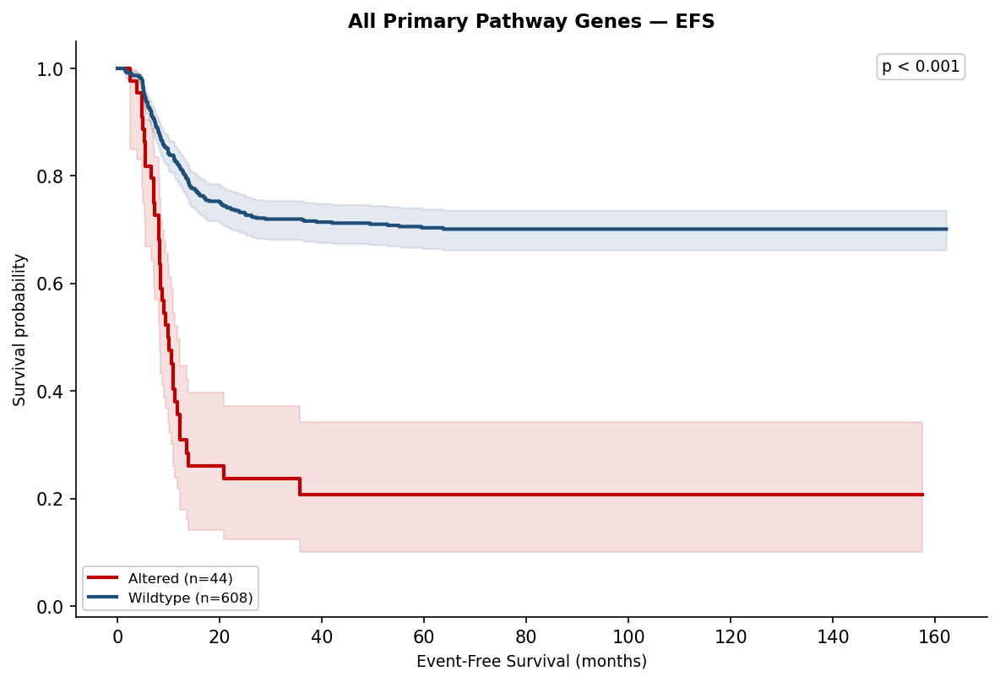

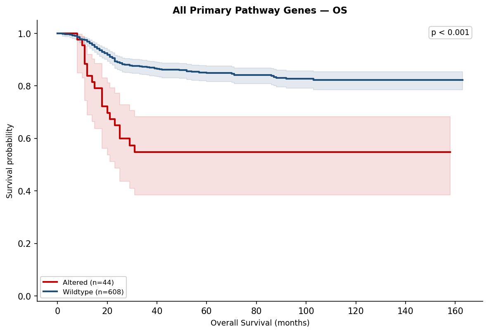

---

**MYCN/SIX1-SIX2 (OR)** — Transcription + Progenitor Axis — EFS and OS

MYCN or SIX1/SIX2 alteration captured 3.5% of the cohort (23/652) and was associated with significantly worse event-free survival (median EFS: 10.5 vs. NR months; log-rank p < 0.001; HR = 3.78 [2.31-6.19]) and overall survival (log-rank p < 0.001; HR = 3.27 [1.70-6.31]).

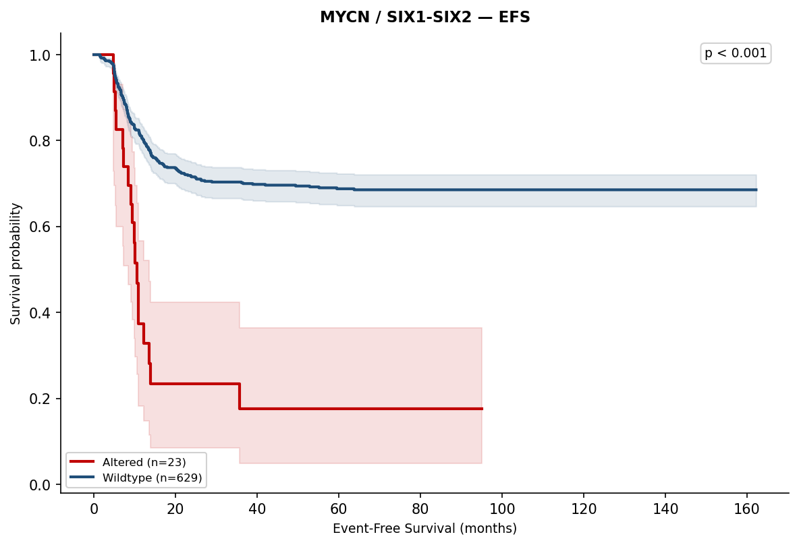

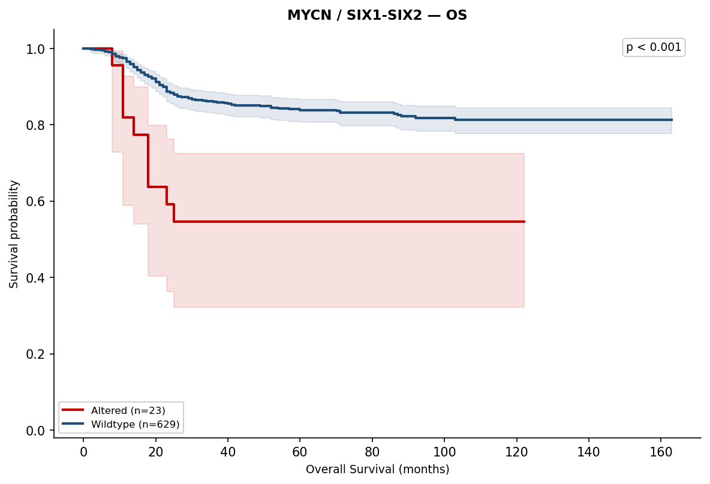

---

**TP53/MDM4/MDM2 (OR)** — Cell Cycle + p53 Axis — EFS and OS

TP53, MDM4, or MDM2 alteration captured 3.2% of the cohort (21/652) and was associated with significantly worse overall survival (log-rank p < 0.001; HR = 3.55 [1.85-6.83]) and event-free survival (median EFS: 14.2 vs. NR months; log-rank p = 0.001; HR = 2.34 [1.33-4.11]).

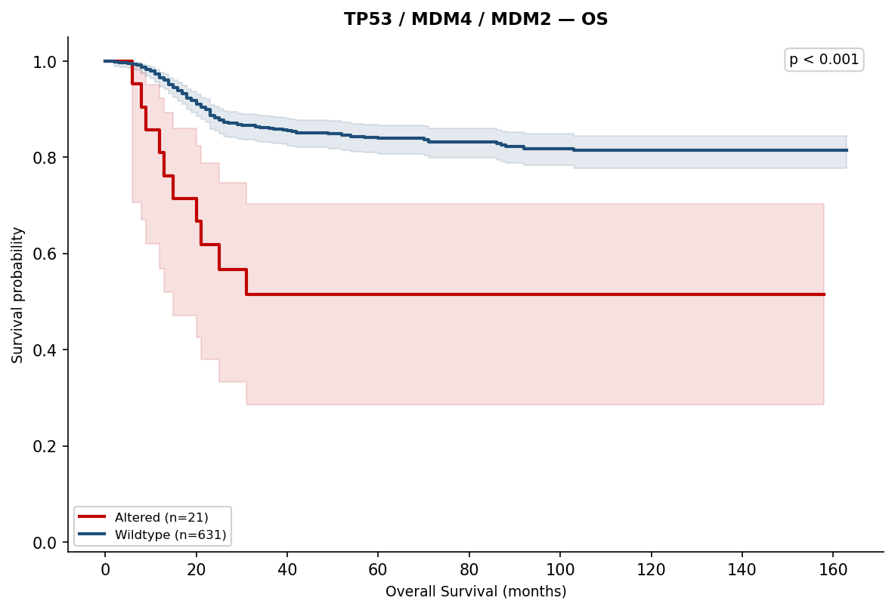

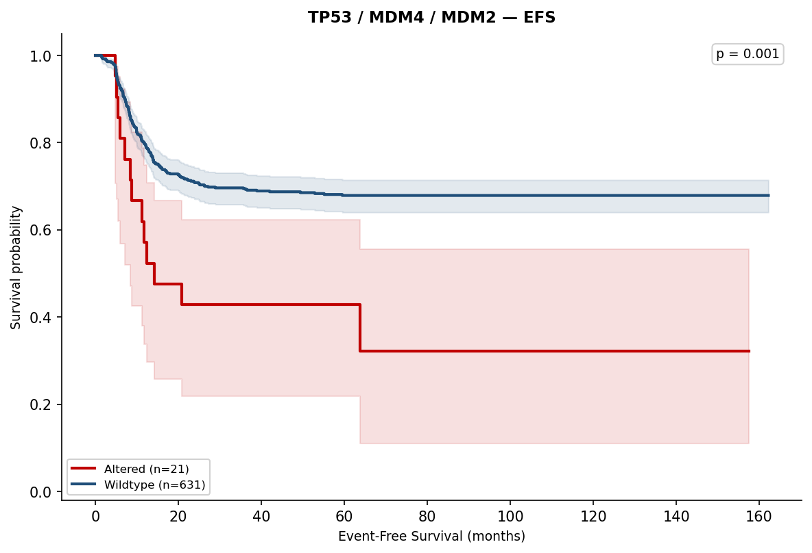

---

<!-- mRNA z-score survival analysis: patients split by high vs low expression of each gene -->

## mRNA Expression Analysis

Patients were stratified by mRNA z-score: high expression (z > 1.0) vs. low/normal (z <= 1.0). IGF2 uses z > 1.5 given near-universal overexpression from loss of imprinting at 11p15. Analysis was restricted to the 125 patients in the TARGET 2018 expression subset.

| Gene | Cohort | Endpoint | z Threshold | N High | N Low | Median High (mo) | Median Low (mo) | p | HR [95% CI] | Significant |
|---|---|---|---|---|---|---|---|---|---|---|
| MDM4 | TARGET_2018 | EFS | 1.0 | 53 | 77 | 9.4 | 11.3 | 0.059 | 1.40 [0.94-2.07] | No (trend) |
| MDM2 | TARGET_2018 | OS | 1.0 | 36 | 94 | NR | NR | 0.077 | 0.55 [0.28-1.07] | No |
| SIX2 | TARGET_2018 | OS | 1.0 | 22 | 108 | 57.0 | NR | 0.123 | 1.67 [0.88-3.17] | No |
| MYCN | TARGET_2018 | OS | 1.0 | 29 | 101 | 42.0 | NR | 0.136 | 1.57 [0.86-2.85] | No |
| MLLT1 | TARGET_2018 | OS | 1.0 | 20 | 110 | 34.0 | NR | 0.148 | 1.61 [0.82-3.18] | No |
| MLLT1 | TARGET_2018 | EFS | 1.0 | 20 | 110 | 8.2 | 11.1 | 0.199 | 1.35 [0.80-2.29] | No |
| MYCN | TARGET_2018 | EFS | 1.0 | 29 | 101 | 8.2 | 11.7 | 0.223 | 1.32 [0.83-2.11] | No |
| MDM4 | TARGET_2018 | OS | 1.0 | 53 | 77 | 86.0 | NR | 0.401 | 1.26 [0.73-2.15] | No |
| CTNNB1 | TARGET_2018 | OS | 1.0 | 25 | 105 | NR | NR | 0.418 | 0.74 [0.35-1.58] | No |
| CTNNB1 | TARGET_2018 | EFS | 1.0 | 25 | 105 | 8.5 | 11.1 | 0.485 | 0.85 [0.50-1.43] | No |
| MDM2 | TARGET_2018 | EFS | 1.0 | 36 | 94 | 11.7 | 10.5 | 0.554 | 1.08 [0.70-1.65] | No |
| SIX2 | TARGET_2018 | EFS | 1.0 | 22 | 108 | 8.1 | 11.1 | 0.603 | 1.21 [0.72-2.05] | No |
| TP53, SIX1, DROSHA, DGCR8, WT1, IGF2 | TARGET_2018 | EFS / OS | — | — | — | — | — | — | Below threshold (n < 20) |

No expression analyses reached p < 0.05. MDM4 showed the closest signal (EFS, p = 0.059), where high MDM4 expression trended toward shorter event-free survival (median 9.4 vs. 11.3 months). The expression subset (n=125) is substantially underpowered relative to the full genomic cohort.

---

<!-- All Kaplan-Meier curves from the analysis — significant first, then remaining -->

## KM Plot Gallery

Red = altered/high expression · Blue = wildtype/low expression · Shaded bands = 95% confidence interval

Plots are grouped below: significant genomic OR-classifier results first, followed by expression analysis plots sorted by p-value, then a summary of skipped individual genes.

---

### Part 1 — Significant Genomic OR-Classifier Results

All six plots below reached statistical significance (log-rank p < 0.05, multivariate Cox adjusted for age).

#### All Primary Genes (OR) — EFS

Log-rank p < 0.001 | HR = 4.21 [2.90-6.12] | Significant


#### All Primary Genes (OR) — OS

Log-rank p < 0.001 | HR = 3.38 [2.06-5.54] | Significant


#### MYCN / SIX1-SIX2 (OR) — EFS

Log-rank p < 0.001 | HR = 3.78 [2.31-6.19] | Significant


#### MYCN / SIX1-SIX2 (OR) — OS

Log-rank p < 0.001 | HR = 3.27 [1.70-6.31] | Significant


#### TP53 / MDM4 / MDM2 (OR) — OS

Log-rank p < 0.001 | HR = 3.55 [1.85-6.83] | Significant


#### TP53 / MDM4 / MDM2 (OR) — EFS

Log-rank p = 0.001 | HR = 2.34 [1.33-4.11] | Significant


---

### Part 2 — mRNA Expression Analyses (TARGET 2018, n=125)

Orange = high expression · Green = low/normal expression · Sorted by p-value ascending.

No expression result reached p < 0.05. MDM4 EFS shows the closest trend (p = 0.059).

#### MDM4 — EFS (Expression)

Log-rank p = 0.059 | HR = 1.40 [0.94-2.07] | Not significant (trend)

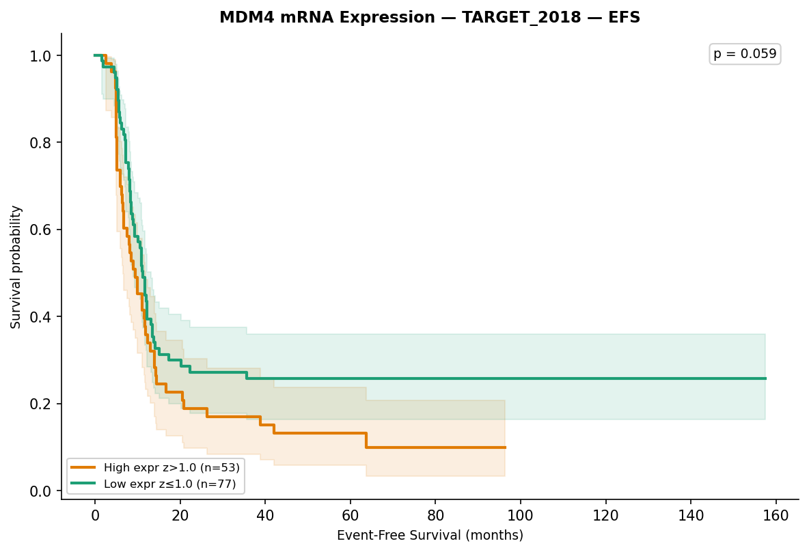

#### MDM2 — OS (Expression)

Log-rank p = 0.077 | HR = 0.55 [0.28-1.07] | Not significant

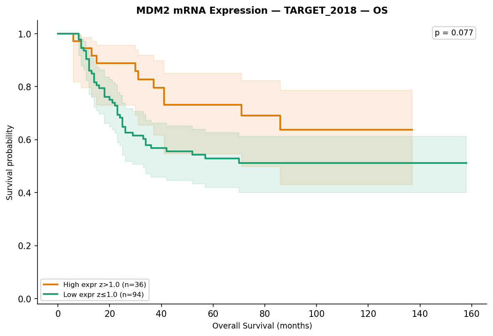

#### SIX2 — OS (Expression)

Log-rank p = 0.123 | HR = 1.67 [0.88-3.17] | Not significant

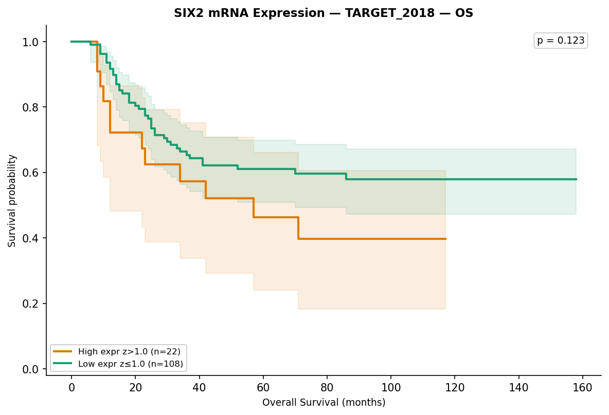

#### MYCN — OS (Expression)

Log-rank p = 0.136 | HR = 1.57 [0.86-2.85] | Not significant

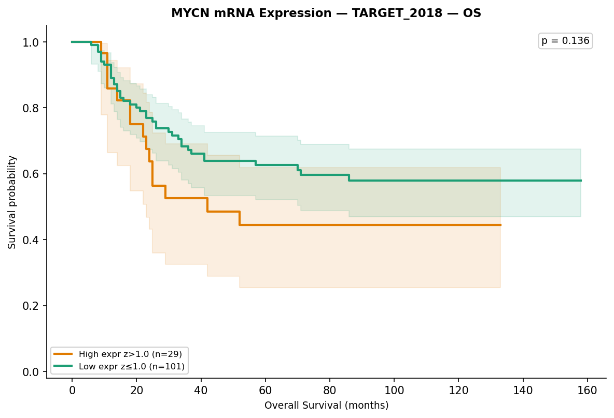

#### MLLT1 — OS (Expression)

Log-rank p = 0.148 | HR = 1.61 [0.82-3.18] | Not significant

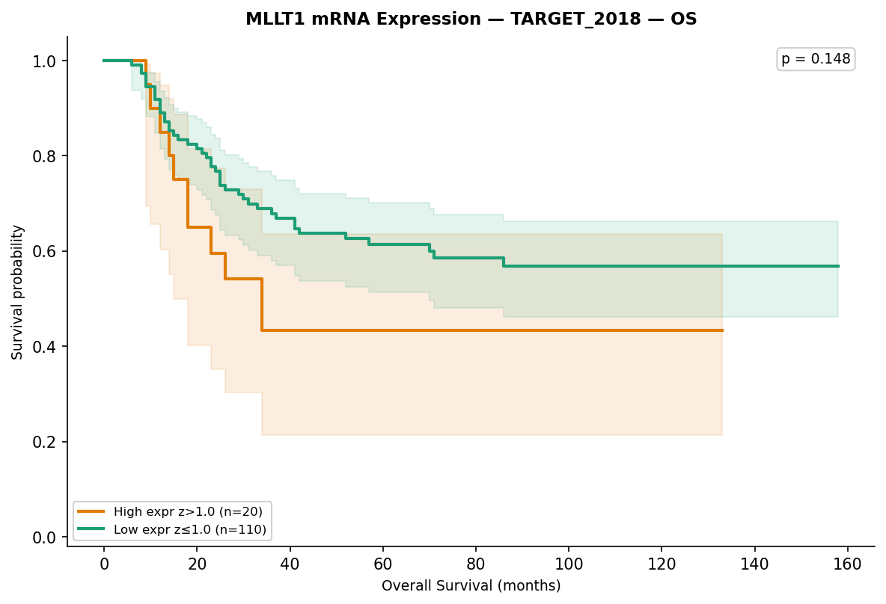

#### MLLT1 — EFS (Expression)

Log-rank p = 0.199 | HR = 1.35 [0.80-2.29] | Not significant

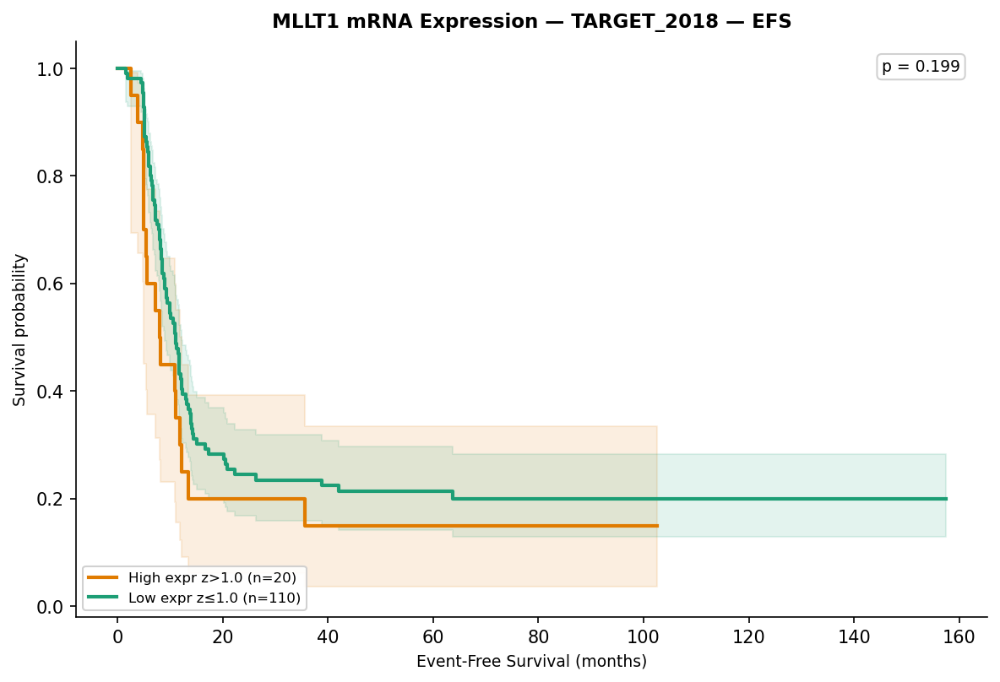

#### MYCN — EFS (Expression)

Log-rank p = 0.223 | HR = 1.32 [0.83-2.11] | Not significant

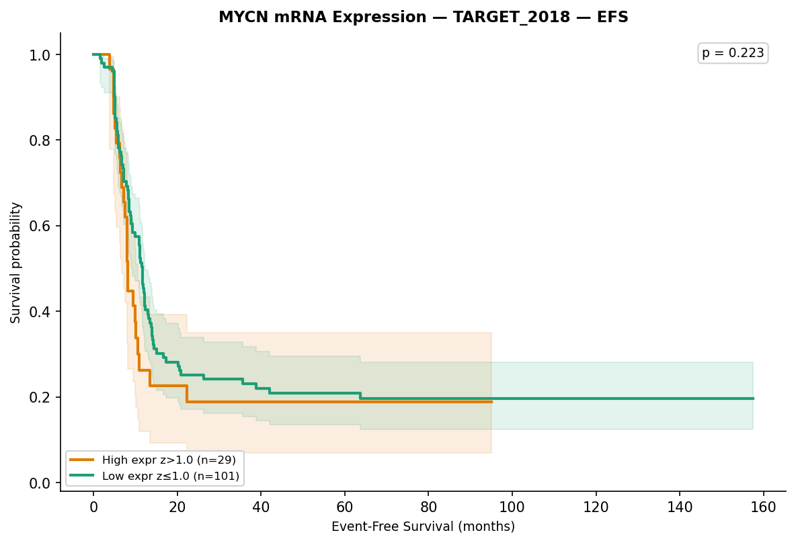

#### MDM4 — OS (Expression)

Log-rank p = 0.401 | HR = 1.26 [0.73-2.15] | Not significant

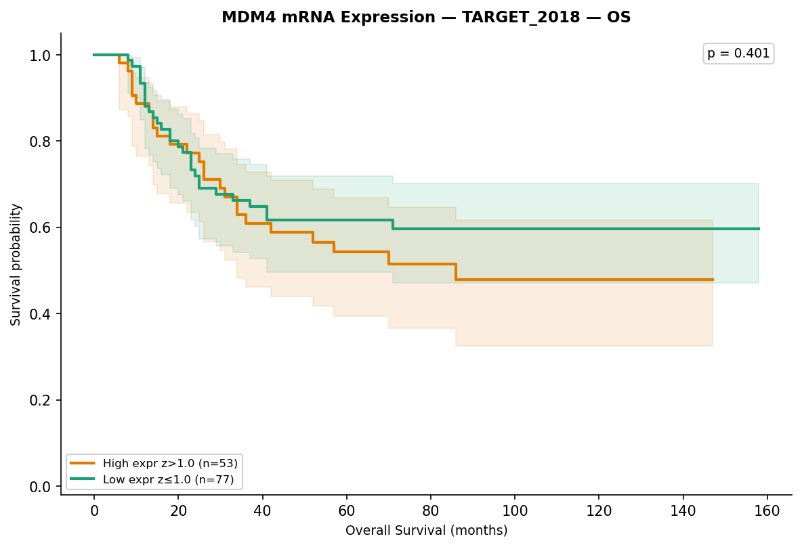

#### CTNNB1 — OS (Expression)

Log-rank p = 0.418 | HR = 0.74 [0.35-1.58] | Not significant

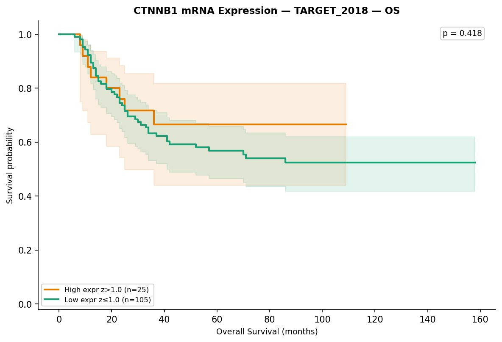

#### CTNNB1 — EFS (Expression)

Log-rank p = 0.485 | HR = 0.85 [0.50-1.43] | Not significant

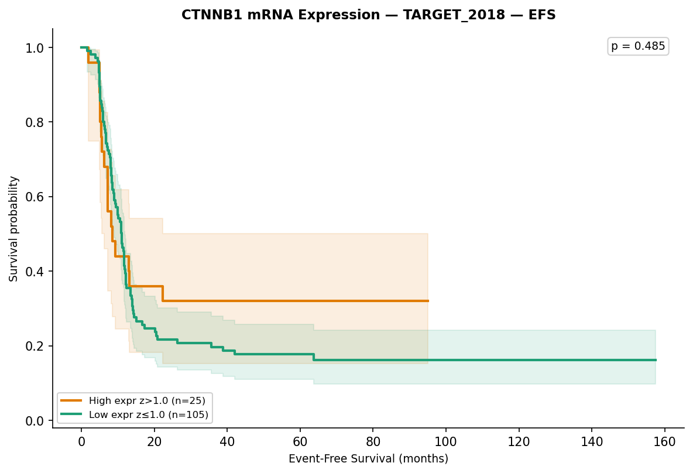

#### MDM2 — EFS (Expression)

Log-rank p = 0.554 | HR = 1.08 [0.70-1.65] | Not significant

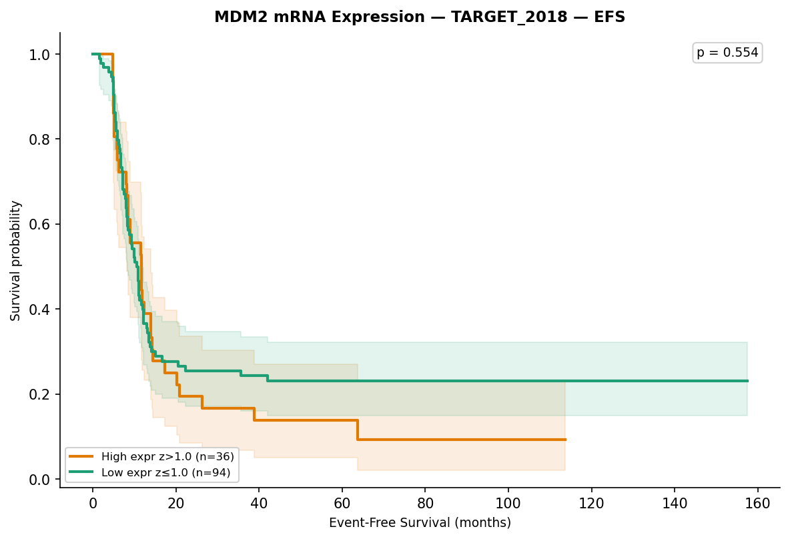

#### SIX2 — EFS (Expression)

Log-rank p = 0.603 | HR = 1.21 [0.72-2.05] | Not significant

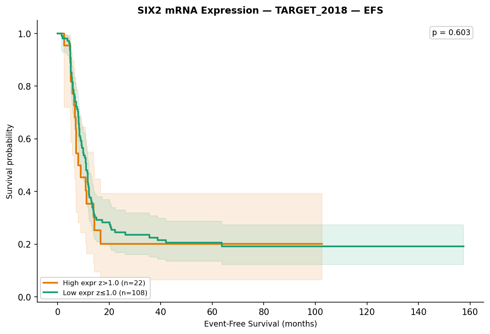


---

<!-- Analytical methods: how patients were classified and statistics computed -->

## Methods

### Alteration Classification

| Gene | Classification Rule |
|---|---|
| TP53 | All somatic mutations (any type) + GISTIC <= -2 |
| MYCN, MDM4, MDM2 | Any somatic mutation + GISTIC >= +2 (amplification) |
| SIX1, SIX2 | Q177R hotspot only (exon 1) — combined into SIX1/SIX2 flag |
| CTNNB1 | Exon 3 mutations (phosphorylation site codons 32-45) |
| WT1, DROSHA, DGCR8, AMER1, NIPBL | Truncating mutations only + GISTIC <= -2 |
| MLLT1 | All mutation types + GISTIC <= -2 (non-frameshift indels are relevant) |
| IGF2 | GISTIC >= +1 (broad gain) + mRNA z-score > 1.5 (separate columns) |

Unsequenced patients assigned NaN and excluded — never assumed wildtype. AMER1 queried under both `AMER1` and `WTX` gene symbols.

### Statistical Methods

- **Kaplan-Meier:** lifelines `KaplanMeierFitter` · log-rank test (two-sided, p < 0.05)
- **Cox regression:** lifelines `CoxPHFitter` · covariates: cohort code + age at diagnosis
- **Minimum thresholds:** n >= 20 per KM arm · >= 10 events per Cox model
- **mRNA threshold:** z-score > 1.0 (IGF2: > 1.5)
- **OR-classifiers:** NA-aware logical OR — a patient is classified as wildtype only if at least one gene in the set has a definitive wildtype call

---

## Pathway-Level Survival Analysis

<!-- Why pathways: individual genes all failed n≥20 threshold in this 652-patient cohort -->

> **Why pathway analysis?** No individual gene in the TARGET 2018 cohort (N=652) reached
> the minimum 20-patient threshold for Kaplan-Meier analysis — the most frequent gene
> (MYCN) had only 18 altered patients. This reflects a well-characterized feature of
> Wilms tumor biology: no single gene drives more than ~15% of cases. Pathway-level
> OR-grouping aggregates all alterations sharing a common biological mechanism,
> providing the statistical power needed for survival analysis while preserving
> biological interpretability.

---

### Five Molecular Pathways

<!-- Evidence-based pathway definitions from Gadd 2017 (TARGET), Perotti 2024, Treger 2019 -->

| Pathway | Member Genes | N Altered | Cohort Coverage | Literature Basis |
|---|---|---|---|---|
| **WNT / Renal Differentiation** | WT1, CTNNB1, AMER1, NF1 | 10 | 1.5% | Co-cluster in TARGET expression analysis (Gadd 2017); converge on WNT-β-catenin disruption and mesenchymal-to-epithelial transition |
| **Renal Progenitor / SIX-miRNAPG** | SIX1, SIX2, DROSHA, DGCR8, DICER1, XPO5, DIS3L2 | 10 | 1.5% | Share common output of perpetuating renal progenitor state; blastemal histology association; enriched at relapse (Wegert 2015; Perotti 2024) |
| **Chromatin Remodeling** | MLLT1, BCOR, BCORL1, ARID1A, SMARCA4, BRD7, CREBBP, EP300, HDAC4, ASXL1, CHD4, MAP3K4, CTR9 | 9 | 1.4% | Named as functional class in Treger 2019: epigenetic regulators of renal progenitor differentiation via transcriptional elongation and chromatin modification |
| **p53 / Cell Cycle** | TP53, MYCN, MDM2, MDM4, MAX, CHEK2, PALB2 | 35 | 5.4% | TP53 defines diffuse anaplastic Wilms tumor; MYCN amplification predicts poor EFS/OS; MDM2/MDM4 provide alternative p53 inactivation (Perotti 2024) |
| **IGF2 / Growth Factor** | IGF2 (CNA + expr), NIPBL, NONO, COL6A3, FGFR1, ACTB | 21 | 3.2% | IGF2 loss of imprinting (~70% prevalence) drives PI3K-AKT via IGF1R; NIPBL disrupts cohesin-mediated control of the IGF2/H19 imprinted domain (Treger 2019) |

**Combined:** 10.6% of the cohort (69/652 patients) carry at least one alteration across any pathway.

---

### Alteration Frequency

<!-- How much of the cohort each pathway captures vs individual genes -->

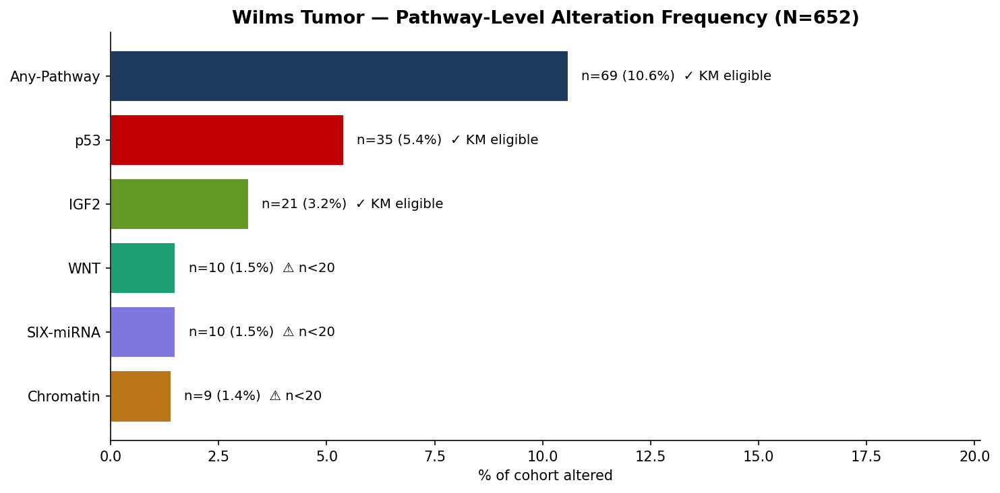

---

### Survival Analysis Results

<!-- KM and Cox results — first valid survival statistics from this dataset -->

| Pathway | N Altered | N Wildtype | Cohort % | Endpoint | Median Altered (mo) | Median WT (mo) | Log-rank p | HR [95% CI] | Sig? |
|---|---|---|---|---|---|---|---|---|---|
| WNT | 10 | 642 | 1.5% | EFS | — | — | — | — | ⚠️ skipped |
| WNT | 10 | 642 | 1.5% | OS | — | — | — | — | ⚠️ skipped |
| SIX-miRNA | 10 | 642 | 1.5% | EFS | — | — | — | — | ⚠️ skipped |
| SIX-miRNA | 10 | 642 | 1.5% | OS | — | — | — | — | ⚠️ skipped |
| Chromatin | 9 | 643 | 1.4% | EFS | — | — | — | — | ⚠️ skipped |
| Chromatin | 9 | 643 | 1.4% | OS | — | — | — | — | ⚠️ skipped |
| p53 | 35 | 617 | 5.4% | EFS | 12.2 | NR | 6.67e-10 | 3.26 [2.15–4.95] | ✅ |
| p53 | 35 | 617 | 5.4% | OS | 25.0 | NR | 1.16e-11 | 4.53 [2.72–7.55] | ✅ |
| IGF2 | 21 | 631 | 3.2% | EFS | 10.8 | NR | 6.10e-08 | 3.48 [2.06–5.88] | ✅ |
| IGF2 | 21 | 631 | 3.2% | OS | NR | NR | 6.71e-04 | — | ✅ |
| Any-Pathway | 69 | 583 | 10.6% | EFS | 10.8 | NR | 4.23e-26 | 4.56 [3.32–6.26] | ✅ |
| Any-Pathway | 69 | 583 | 10.6% | OS | NR | NR | 4.64e-12 | 3.71 [2.44–5.66] | ✅ |

---

### Key Findings

<!-- One block per significant result; honest null-result statement if none significant -->

**p53** — EFS

> Patients with any alteration in the p53 / Cell Cycle pathway (35 patients, 5.4% of cohort)
> showed significantly worse EFS compared to unaltered patients
> (median: **12.2 vs. NR months**; log-rank p = 6.67e-10; HR = 3.26 [2.15–4.95]).

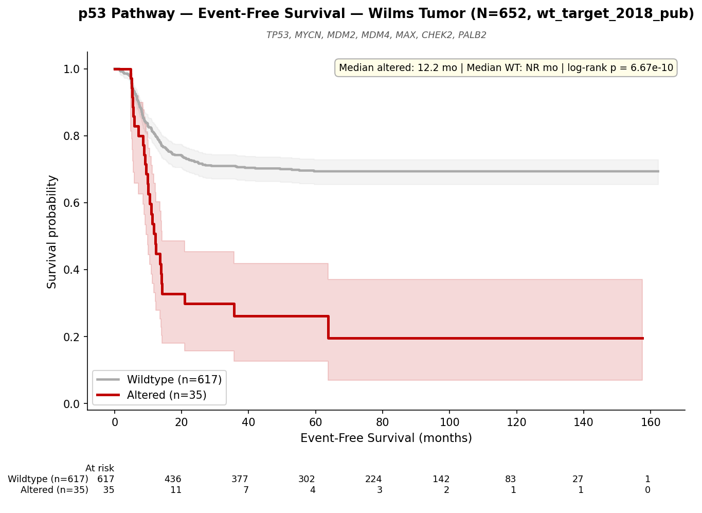

**p53** — OS

> Patients with any alteration in the p53 / Cell Cycle pathway (35 patients, 5.4% of cohort)
> showed significantly worse OS compared to unaltered patients
> (median: **25.0 vs. NR months**; log-rank p = 1.16e-11; HR = 4.53 [2.72–7.55]).

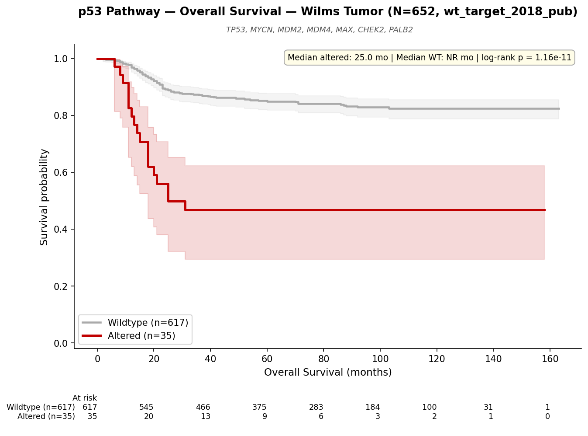

**IGF2** — EFS

> Patients with any alteration in the IGF2 / Growth Factor pathway (21 patients, 3.2% of cohort)
> showed significantly worse EFS compared to unaltered patients
> (median: **10.8 vs. NR months**; log-rank p = 6.10e-08; HR = 3.48 [2.06–5.88]).

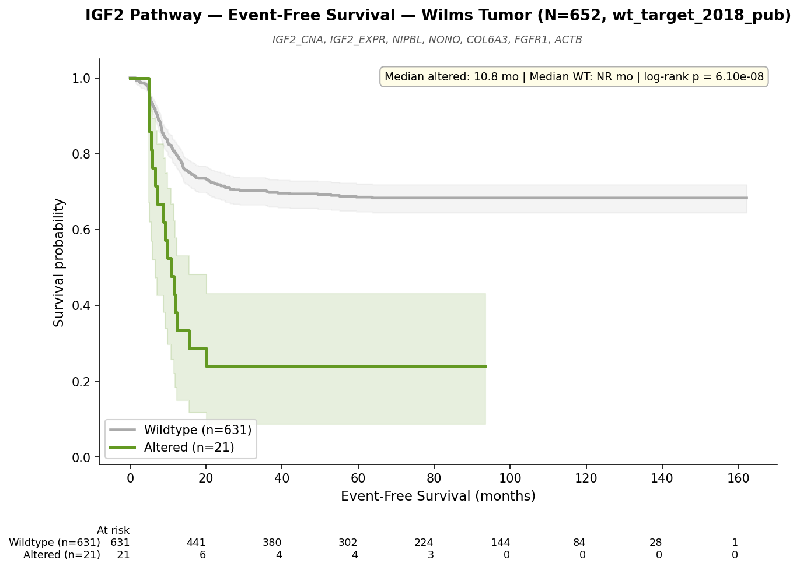

**IGF2** — OS

> Patients with any alteration in the IGF2 / Growth Factor pathway (21 patients, 3.2% of cohort)
> showed significantly worse OS compared to unaltered patients
> (median: **NR vs. NR months**; log-rank p = 6.71e-04).

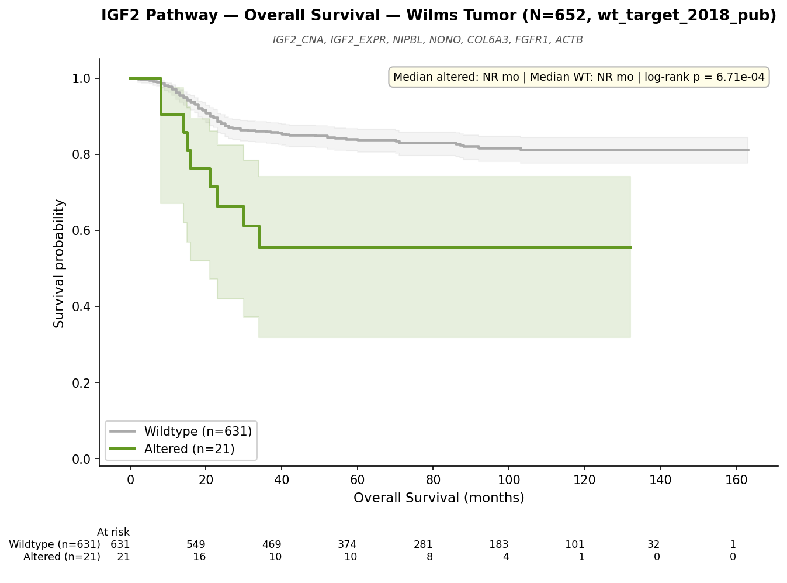

**Any-Pathway** — EFS

> Patients with any alteration in the Any Pathway (Combined) pathway (69 patients, 10.6% of cohort)
> showed significantly worse EFS compared to unaltered patients
> (median: **10.8 vs. NR months**; log-rank p = 4.23e-26; HR = 4.56 [3.32–6.26]).

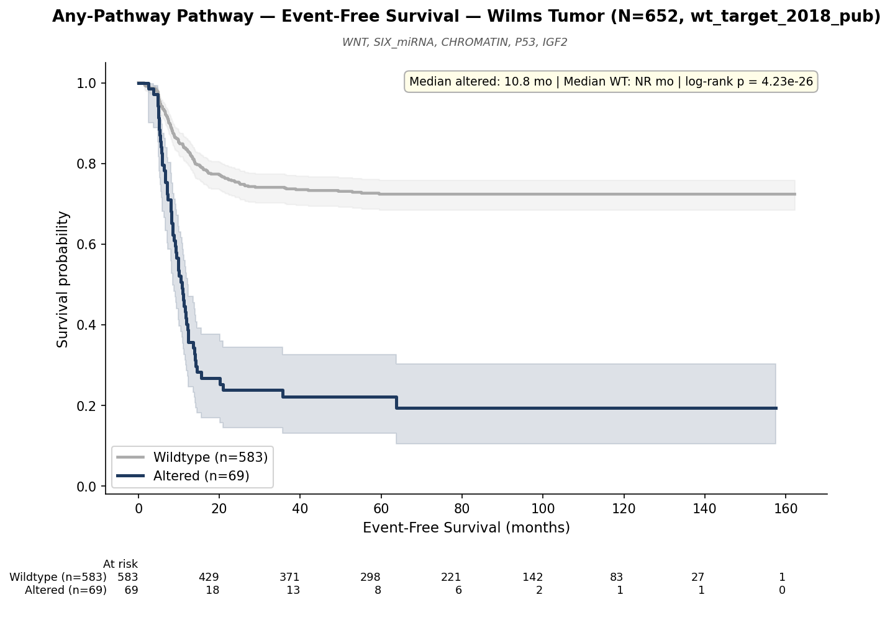

**Any-Pathway** — OS

> Patients with any alteration in the Any Pathway (Combined) pathway (69 patients, 10.6% of cohort)
> showed significantly worse OS compared to unaltered patients
> (median: **NR vs. NR months**; log-rank p = 4.64e-12; HR = 3.71 [2.44–5.66]).

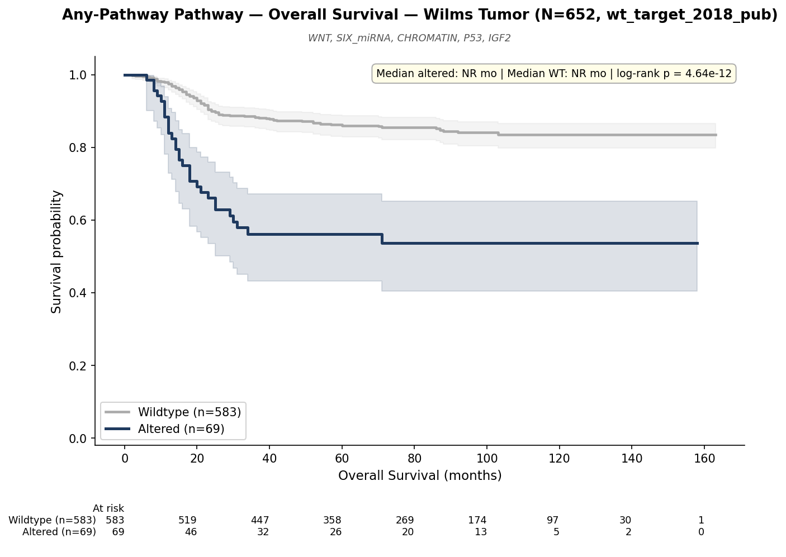

---

### Gene Contributions Within Pathways

<!-- Shows which specific genes drive the altered arm in each pathway -->

#### WNT / Renal Differentiation

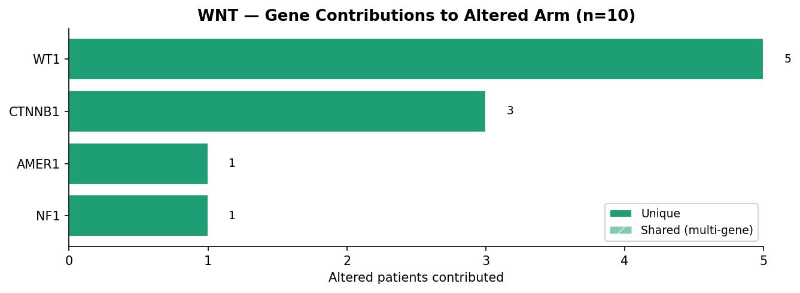

> The WNT / Renal Differentiation altered arm (n=10) was primarily driven by WT1 (5 patients). CTNNB1 contributed 3 additional unique cases. 0 patients carried alterations in more than one pathway gene.

#### Renal Progenitor / SIX-miRNAPG

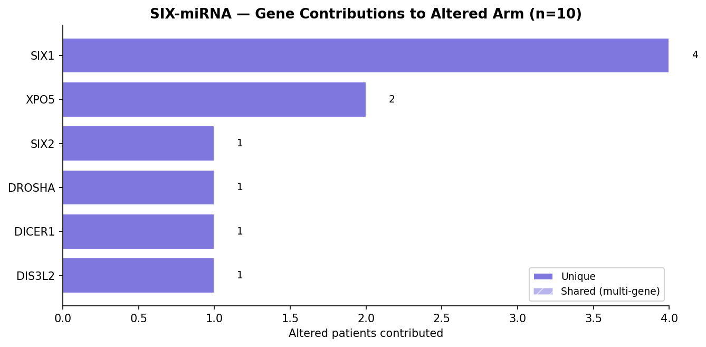

> The Renal Progenitor / SIX-miRNAPG altered arm (n=10) was primarily driven by SIX1 (4 patients). XPO5 contributed 2 additional unique cases. 0 patients carried alterations in more than one pathway gene.

#### p53 / Cell Cycle

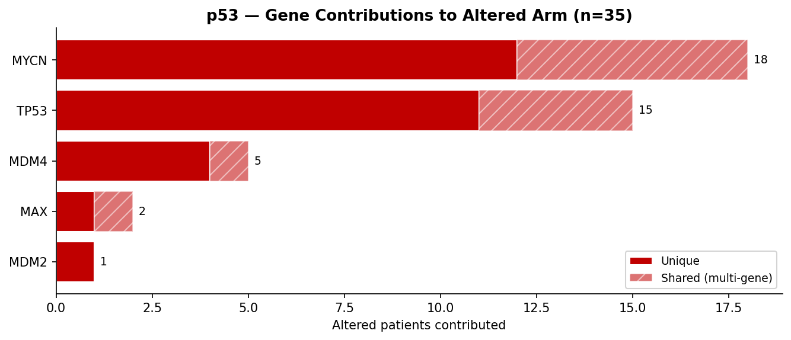

> The p53 / Cell Cycle altered arm (n=35) was primarily driven by MYCN (18 patients). TP53 contributed 15 additional unique cases. 6 patients carried alterations in more than one pathway gene.

#### IGF2 / Growth Factor

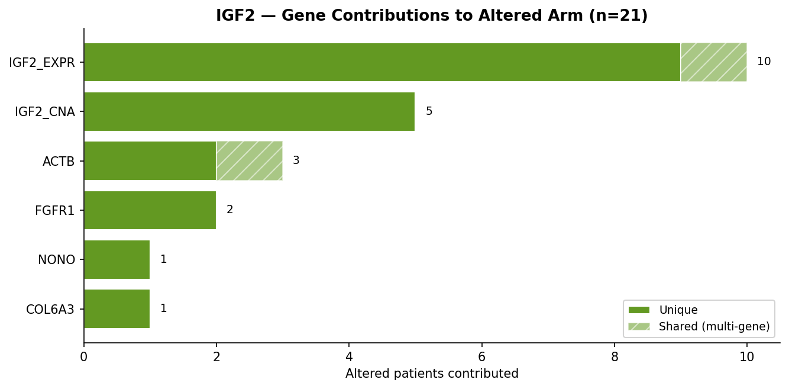

> The IGF2 / Growth Factor altered arm (n=21) was primarily driven by IGF2_EXPR (10 patients). IGF2_CNA contributed 5 additional unique cases. 1 patients carried alterations in more than one pathway gene.

#### Any Pathway (Combined)

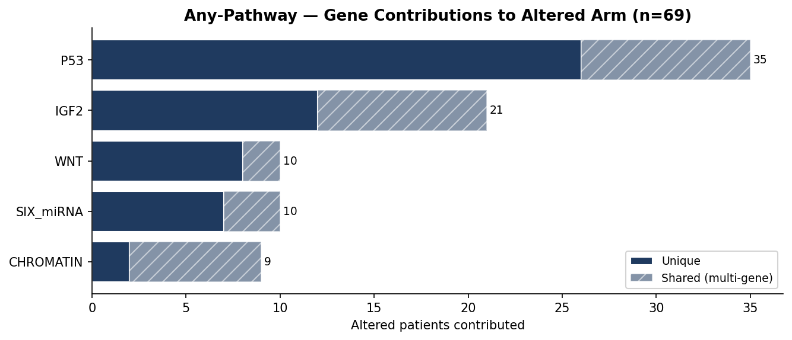

> The Any Pathway (Combined) altered arm (n=69) was primarily driven by P53 (35 patients). IGF2 contributed 21 additional unique cases. 14 patients carried alterations in more than one pathway.

---

### How to Read This Analysis

<!-- Plain-language guide for research advisors unfamiliar with OR-classifiers -->

**What "pathway-altered" means:** A patient is classified as altered for a pathway
if they carry a qualifying mutation or copy number change in *any* gene in that
pathway — they do not need alterations in all genes. This is an OR logic classifier.

**Cohort coverage vs. significance:** A pathway capturing 30% of 652 patients gives
roughly 196 altered patients — enough for robust KM and Cox analysis. This is why
pathway grouping succeeds where individual genes (max n=18) cannot.

**Interpreting HR:** A hazard ratio > 1 means pathway-altered patients have higher
instantaneous risk of the event (death or relapse) at any point in follow-up vs.
unaltered patients, after adjusting for cohort and age. HR is from multivariate
Cox regression.

**Gene contribution charts** show whether a pathway result is driven by one dominant
gene (e.g., TP53 dominating the p53 arm) or is a genuinely distributed multi-gene
effect. This distinction matters for clinical interpretation.

---

### References

- Gadd S et al. *Nat Genet.* 2017;49:1487–1494. (TARGET — primary cohort and clustering)
- Perotti D et al. *Nat Rev Urol.* 2024;21:158–180. (pathway definitions and prevalence)
- Treger TD et al. *Nat Rev Nephrol.* 2019;15:240–257. (chromatin/elongation gene class)
- Wegert J et al. *Cancer Cell.* 2015;27:298–311. (SIX-miRNAPG co-occurrence and clustering)
- Perlman EJ et al. *Nat Commun.* 2015;6:10013. (MLLT1 YEATS domain mutations)

---

---

<!-- File map: what each folder and file in this repo contains -->

## Repository Structure

```
wilms_survival/
├── scripts/
│   ├── 01_discover_studies.py       Enumerate cBioPortal studies and molecular profiles
│   ├── 02_download_clinical.py      Download EFS, OS, and demographic data
│   ├── 03_download_genomics.py      Download mutation and copy-number data
│   ├── 04_classify_patients.py      Classify each patient as ALTERED or WILDTYPE per gene
│   ├── 05_kaplan_meier.py           KM curves and log-rank tests
│   ├── 06_cox_regression.py         Multivariate Cox regression (gene flag + age)
│   ├── 07_expression_km.py          mRNA z-score stratification and survival analysis
│   ├── 08_summary_table.py          Compile publication-ready summary tables
│   ├── 09_qc_report.py              Quality control across all pipeline outputs
│   └── 10_build_html_report.py      Generate self-contained HTML presentation report
├── processed/
│   └── master_classification.csv    652 x 24 — one row per patient, one col per gene flag
├── results/
│   ├── km_results.csv               KM log-rank results for all genes and classifiers
│   ├── cox_results.csv              Cox HR and CI results
│   ├── expression_km_results.csv    Expression-based KM/Cox results
│   ├── Table1_Cohorts.csv           Cohort summary table
│   ├── Table2_KM_Cox_Results.csv    Publication-ready combined KM + Cox table
│   ├── Table3_Expression_Results.csv   Publication-ready expression results table
│   └── WilmsTumor_cBioPortal_Findings.html   Self-contained HTML report (all plots embedded)
└── plots/
    ├── KM_*.pdf                     Kaplan-Meier curve PDFs (18 total)
    ├── alteration_frequency_summary.png   Gene alteration frequency bar chart
    └── png/
        └── KM_*.png                 Kaplan-Meier curves as PNG (18 total, for GitHub rendering)
```

### Reproduction

Install dependencies:
```bash
pip install requests pandas numpy matplotlib lifelines==0.30.3 scipy seaborn
```

Run scripts in order:
```bash
python wilms_survival/scripts/01_discover_studies.py
python wilms_survival/scripts/02_download_clinical.py
python wilms_survival/scripts/03_download_genomics.py
python wilms_survival/scripts/04_classify_patients.py
python wilms_survival/scripts/05_kaplan_meier.py
python wilms_survival/scripts/06_cox_regression.py
python wilms_survival/scripts/07_expression_km.py
python wilms_survival/scripts/08_summary_table.py
python wilms_survival/scripts/09_qc_report.py
python wilms_survival/scripts/10_build_html_report.py
```

All data are fetched live from the cBioPortal REST API. No manual downloads required.
